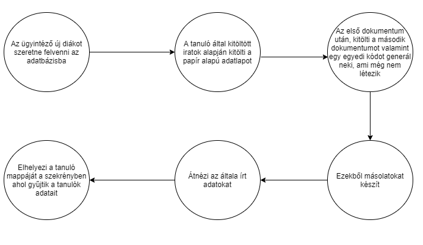
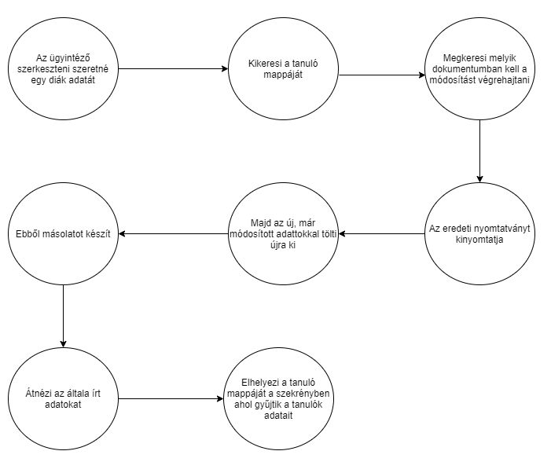
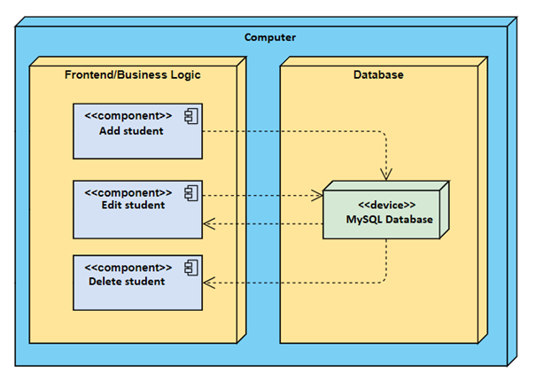

# Rendszerterv - Ádám&Fecó csapat

## 1.  A rendszer célja
 
A rendszer alapvető célja egy olyan asztali alaklazmás, amely segítsgévével az ügyintézők képesek tanulók szerkesztésére a nyilvántartásba, képesek hozzáadni új tanulókat, a meglévő tanulók adatait frissíteni, szükség esetén törölni, valamint ki listázni egy-egy, vagy akár az összes tanuló adatát. Az alkalmazás nem tartalmaz reklámokat. Nem célja az alkalmazásnak, hogy a tárolt adatokat továbbítsa bármilyen szervezet felé. Továbbá nem szükséges, hogy bárki hozzáférhessen az adatokhoz, sőt tehát nem az interneten kell futnia az alkalmazásnak, csak az iskola helyi hálózatán.
Az alkalmazás feladati közé tartozik, az iskolába újonnan érkező diákok felvétele, a jelenleg az oktatási intézménybe beírakozott diákok listázása, amennyiben megváltozik egy diák személyes adata legyen lehetőség a programban is átírni az adott adatot továbbá, ha egy diák úgy dönt, hogy itt hagyja az iskolát a program legyen alkalmas arra, hogy ellehessen távolítani diákokat a kilistázásból. Az ügyfél jelenleg nem rendelkezik, semmilyen alkalmazással, ami esetleges módon megkönnyíthetné a munkáját.

Jelenleg adatlapokon tartják nyílván a diákok adatait amiket mappákba rendezve tárolnak, mivel emberi munkáról van szó az adminisztrálásban is így a hibák gyakoriak, a papír alapú rendszer lassú, nem megbízható. Az implementációt Java Springel valósítjuk meg, a tanulók adatit phpmyadmin adatbázisban tároljuk.A csapat feladata, egy olyan alkalmazás fejlesztése, ami egy iskola ügyintézőinek a munkáját könnyíti meg. Az alkalmazás feladati közé tartozik, az iskolába újonnan érkező diákok felvétele, a jelenleg az oktatási intézménybe beírakozott diákok listázása, amennyiben megváltozik egy diák személyes adata legyen lehetőség a programban is átírni az adott adatot továbbá, ha egy diák úgy dönt, hogy itt hagyja az iskolát a program legyen alkalmas arra, hogy ellehessen távolítani diákokat a kilistázásból.

Az ügyfél jelenleg nem rendelkezik, semmilyen alkalmazással, ami esetleges módon megkönnyíthetné a munkáját. Jelenleg adatlapokon tartják nyílván a diákok adatait amiket mappákba rendezve tárolnak, mivel emberi munkáról van szó az adminisztrálásban is így a hibák gyakoriak, a papír alapú rendszer lassú, nem megbízható. Az implementációt Java Springel valósítjuk meg, a tanulók adatit phpmyadmin adatbázisban tároljuk.

## 2.  Projektterv

A projekten dolgozók:

A projekt menedzselését és felügyelését végző személyek:

|  Dátum | Tevékenység  |
|-----------------------|--------------------------|
|    2021.02.02-03.09   | Dokumentációk elkészítése és véglegesítése | 
|         2021.03.09-         |Fejlesztés megkezdése|
|         2020.03.09-         |Unit tesztek| 
|                |Alpha teszt|
|                |Béta teszt|
|                  |Projekt átadása|

## 3. Jelenlegi üzleti folyamatok

A jelenleg az iskolában használt módszer szerint, az ügyintézőknek kézzel kell kitölteniük a tanulók adatlapjait, majd ezeket az adatlapokat mappákba szervezni és fizikai módon tárolni. Alapvetően két fajta esetet különböztetünk meg. Egyik amikor egy új diákot kell felvenni, az ő adatai alapján kitöltik az adatlapot, majd ezt azt adatlapot alapos átnézések és többszöri adategyeztetés után, lemásolják majd mappába rendezik és fizikai módon tárolják őket egy polcban.

A másik eset, amikor egy már beirakozott tanulónak változik valamilyen adata, ebben az esetben az ügyintézőnek megkell keresni a mappa szerkezetből az adott tanuló mappáját, ebből kiszedni azt a lapot melyen a változtatni kívánt adat szerepel, nyomtatni egy új lapot, majd azt kitölteni az új adatnak megfelelően, végezetül már csak visszakell tenni a mappába az adatlapot, azt pedig a mappaszerkezetbe.
 
## 4. Igényelt üzleti folyamatok
 
## 5. Követelménylista
 
## 6. Absztrakciós modell

A program működése során a felhasználó egy féle szerepkörben figyelhető meg. A felhasználó képes tanulókat kezelni az adatbázisban, képes hozzáadni új tanulót, szerkeszteni egy már meglévő tanuló adatait, valamint törölheti őket. A felhasználó képes egy vagy akár az összes tanuló kilistázására.
 
## 7. Architekturális terv

 
## 8. Adatbázis terv

students tábla

| Mező név | Tipus/hossz | Kötelező | Érték/validáció | Kulcs | Megj. |
|----------|-------------|----------|-----------------|-------|-------|
| neptun_code | VARCHAR(255) | Igen | Unique | PK| |
| Name | VARCHAR(255) | Igen | | |
| birth_date | date | Igen| | |
| PassedSemester | int(11) | Igen| | |
| Department | VARCHAR(255) | Igen| | |

students megszorítások

| Azonosító | Tábla 1 | Mező 1 | Tábla 2 | Mező 2 | Megj. |
|-----------|---------|--------|---------|--------|-------|
| students_PK | studentstable | neptun_code | | | |

languageknowladge tábla

| Mező név | Tipus/hossz | Kötelező | Érték/validáció | Kulcs | Megj. |
|----------|-------------|----------|-----------------|-------|-------|
| Id | INT(11) | Igen | Auto-increment | PK | |
| language | varchar(255) | Igen | |  | | 
| level | varchar(255) | Igen | |  | | 
| studentsTable | varchar(255) | Igen | | FK | | 
| idx | INT(11) | Igen | |  | | 

languageknowladge megszorítások

| Azonosító | Tábla 1 | Mező 1 | Tábla 2 | Mező 2 | Megj. |
|-----------|---------|--------|---------|--------|-------|
| languageknowladge_PK | languageknowladge | Id | | | |
| students_FK | languageknowladge | Id | studentstable | neptun_code | |

## 9. Implementációs terv

Az alkalmazás felületét és a mögötte rejlő logikát Java Spring-el, valamint mySql adatbázissal valósítjuk meg. Igyekszünk a felhasználó számára csak a működéshez feltétlenül szükséges mezőket, gombokat megjeleníteni, nem célunk, hogy kezelhetetlennek tűnjön az alkalmazás. Az általunk választott fejlesztőkörnyezet az InteliJ Idea Ultimate legújabb verziója. A csapat minden tagja egyetértett a fejlesztőkörnyezet választásában, a tesztek könnyen elvégezhetőek benne, legenerálhatóak.

## 10. Teszt terv
 
## 11. Telepítési terv

Az alkalmazás telepítéséhez csupán egy számítógépre van szükség, amin van egy webböngésző, valamint az áltaunk használt fejlesztőikörnyezet. Azért van szükség, mert a fejlesztés alatt álló alkalmazást, fejlesztőkörnyezettel lehet föltelepíteni a készülékre. A fejlesztés után, mint más nem play áruház-béli alkalmazást lehet telepíteni az eszközön, feltéve, ha engedélyezve van az, hogy a nem play áruházból való alkalmazást is lehessen telepíteni az eszközre.
 
## 12. Funkcionális terv

Rendszerszereplők:

    Felhasználó

Rendszer használati esetek és lefutásaik:

    Felhasználó:
                - Tanulók listázása
                - Új tanuló hozzáadása
                - Tanuló törlése
                - Tanuló szerkesztése
                - Egy tanuló adatainak kilistázása

Menü hierarchiák:

    Főmenü:
            -Tanulók listázása
            -Új tanuló hozzáadása
            -Tanuló törlése
            -Tanuló szerkesztése

    Tanulók listázása szak szerint:
                                    -CS tanulók kilistázása
                                    -ITL tanulók kilistázása
                                    -BI tanulók kilistázása
                                    -TI tanulók kilistázása

## 13. Fizikai környezet
 
1.	Kliens:
•	Eszköz: Számítógép/Laptop
•	Operációs rendszer: Windows/Linux
•	Szükséges applikáció a program megfelelő működésének érdekében: Webböngésző (Chrome,Opera)
•	Konfiguráció: Nem specifikus.
2.	Szerver:
•	Eszköz: Kliens
•	Specifikáció: Klienssel ekvivalens
•	Operációs rendszer: Klienssel ekvivalens
•	Komponensek: MySql adatbázis

## 14. Karbantartási terv

A szoftveren a későbbiekben nem kell nagyobb karbantartásokat elvégezni. Az esetleges karbantartások a következőből állhatnak:
•	Tesztelés frissebb verziójú android használatával. Hiba észlelése esetén azok javítása.
•	Esetleges YouTube változtatásokra való reagálás.
•	Igény esetén új funkciók hozzáadása.
